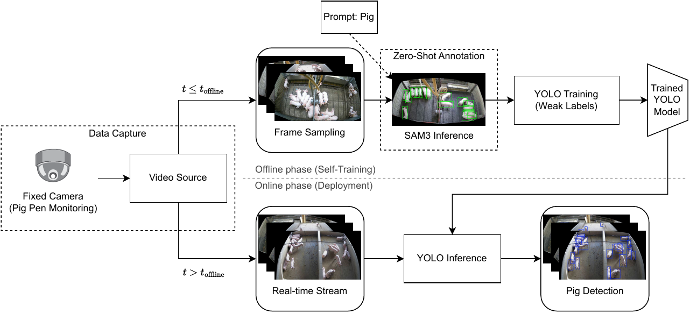
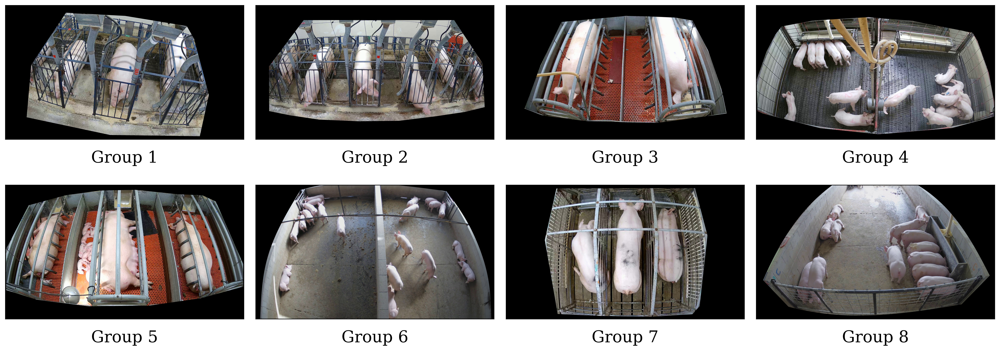

# SAM3-Assisted Training of Lightweight YOLO Models for Precision Pig Farming

<table width="100%"><tr>
<td align="center" width="50%"><a href="reports/report.pdf"></a></td>
<td align="center" width="50%"></td>
</tr></table>

[](https://doi.org/10.48550/arXiv.2605.25860)

Knowledge distillation experiment using SAM3 as a teacher model to generate pseudo-labels for training compact YOLOv8 detection models on the PigLife dataset.

## Requirements

| | |
|---|---|
| **Python** | 3.10+ |
| **GPU** | NVIDIA CUDA (≥ 8 GB VRAM recommended) |
| **Disk** | ≥ 20 GB free (dataset is ~16 GB) |
| **Accounts** | PigLife dataset access + HuggingFace token for SAM3 |

## Setup

**1. Install dependencies**

```bash
uv sync
```

**2. Configure environment**

Copy `.env.example` to `.env` and fill in the two required values:

```bash
cp .env.example .env
```

| Variable | Where to get it |
|---|---|
| `PIGLIFE_URL` | Request access at [AIFARMS Data Portal](https://data.aifarms.org/view/piglife) |
| `HF_TOKEN` | [HuggingFace settings → Access Tokens](https://huggingface.co/settings/tokens) |

---

## Pipeline

Each step is an `invoke` task. Run them in order or use `uv run inv all` to execute the full pipeline automatically.

### Step 1 — Build dataset

Downloads the PigLife zip, extracts images, sanitizes annotations, splits into train/val/test, and converts to YOLO format.

```bash
uv run inv build
```

Output: `datasets/piglife/yolo/human/`

---

### Step 2 — Generate SAM3 pseudo-labels

Runs SAM3 (zero-shot, text prompt `"pig"`) on all images to produce pseudo-annotations, then converts them to YOLO format.

```bash
uv run inv label
```

Output: `datasets/piglife/coco/sam3/annotations/` and `datasets/piglife/yolo/sam3/`

> This step requires a GPU and a HuggingFace token with access to `facebook/sam3`.

---

### Step 3 — Train YOLOv8 models

Trains YOLOv8n, YOLOv8s, and YOLOv8m on both annotation sources (human and SAM3). Resumes automatically from the last checkpoint if interrupted.

```bash
uv run inv train
```

To train a single source:

```bash
uv run inv train --source human
uv run inv train --source sam3
```

Output: `runs/{source}/{model}/weights/best.pt`

---

### Step 4 — Predict (Evaluate YOLO models)

Runs YOLO validation on the test split for every trained model and saves COCO-format prediction JSONs.

```bash
uv run inv predict
```

To predict for a single source:

```bash
uv run inv predict --source human
uv run inv predict --source sam3
```

Output: `runs/{source}/{model}/predictions.json`

---

### Step 5 — Compute metrics and benchmarks

Calculates COCO accuracy metrics (mAP 50-95, mAP 50, mAP 75) and latency benchmarks (forward-pass and full pipeline) for all models.

```bash
uv run inv metrics
```

Output: `reports/output/metrics/`

---

### Step 6 — Generate report tables

Produces publication-ready LaTeX tables from the computed metrics.

```bash
uv run inv report
```

Output: `reports/output/latex/`

---

### Run everything at once

```bash
uv run inv all
```

---

## Extra Datasets Experiments

You can also run experiments with the **BamaPig2D** and **FaroPigSeg** datasets. These datasets are converted from their original formats (COCO and YOLO Seg) to YOLO Detection format automatically.

### 1. Download and Extract

First, download the datasets into the `zips/` folder and extract them to `datasets/`:

**FaroPigSeg**
```bash
cd zips/
wget https://data.chalearnlap.cvc.uab.cat/FaroPig/FaroPigSeg.zip
unzip FaroPigSeg.zip -d ../datasets/
cd ..
```

**BamaPig2D**
```bash
cd zips/
gdown 'https://drive.google.com/file/d/1yWBtNpYpkUdGKDqUAE7ya5m_fwinn0HN/view?usp=sharing'
unzip BamaPig2D.zip -d ../datasets/
cd ..
```

### 2. Prepare the datasets

This task converts the raw datasets (Bama's COCO and Faro's Segmentation) into the unified YOLO Detection format used in the project.

```bash
uv run inv setup-bama-and-faro
```

### 3. Generate SAM3 Pseudo-labels (Optional)

You can generate pseudo-labels specifically for these datasets using SAM3:

```bash
uv run inv label --dataset bama
uv run inv label --dataset faro
```

Output: `datasets/sam3-bama/yolo/` and `datasets/sam3-faro/yolo/`

### 4. Run SAM3 Zero-shot Predictions (Optional)

To evaluate the zero-shot baseline of SAM3 on these datasets, generate the predictions file on the test split:

```bash
uv run inv predict-teacher --dataset bama
uv run inv predict-teacher --dataset faro
```

Output: `datasets/sam3-bama/coco/annotations/predictions_test.json` and `datasets/sam3-faro/coco/annotations/predictions_test.json`

### 5. Train and Predict

Train models on the original (human) labels or the SAM3 pseudo-labels:

```bash
# Training
uv run inv train --source bama       # Original human labels
uv run inv train --source sam3-bama  # SAM3 pseudo-labels

# Predictions
uv run inv predict --source bama
uv run inv predict --source sam3-bama
```

---

## Extra tools

**Interactive prediction gallery** — visualize ground truth vs. model predictions on test images:

```bash
uv run streamlit run extra/gallery.py
```

**List all available tasks:**

```bash
uv run inv --list
```

## Citation

If you use this work, please cite:

```bibtex
@article{faria2026sam3,
  title={SAM3-Assisted Training of Lightweight YOLO Models for Precision Pig Farming},
  author={Faria, Marcos Vinicius Mendes and Pereira, Thiago Borges and Condotta, Isabella C.F.S. and Paix{\~a}o, Thiago Meireles and Boldt, Francisco de Assis},
  journal={arXiv preprint arXiv:2605.25860},
  year={2026},
  doi={10.48550/arXiv.2605.25860}
}
```
